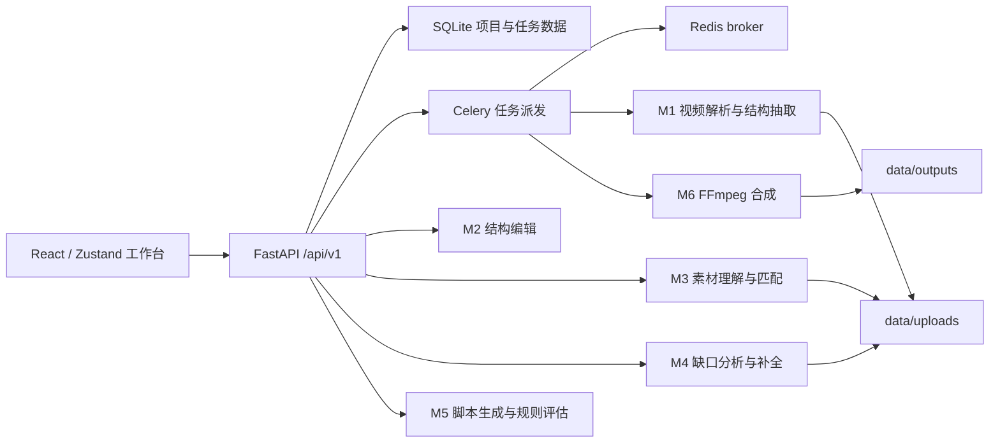
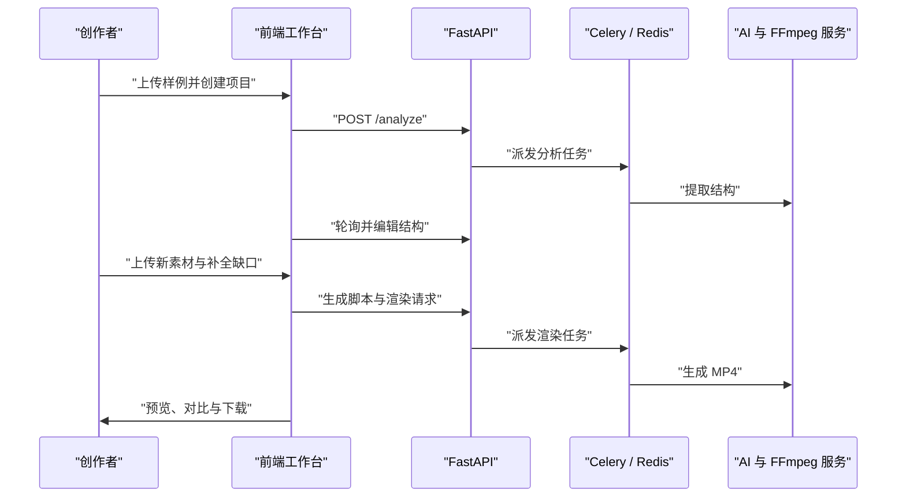

# StructForge - 爆款结构迁移引擎

## 产品目标与赛题映射

StructForge 将优质样例中的创作结构迁移到新的商品信息和用户素材，而不是复制原视频内容。当前产品覆盖样例解析、三类结构拆解、素材理解与匹配、缺口补全、分镜脚本生成、多版本成片渲染与过程可视化。

| 赛题能力 | 实现模块 | 可演示证据 |
| --- | --- | --- |
| 样例输入与基础解析 | M1 | 上传视频、元信息、封面、镜头与结构结果 |
| 结构拆解 | M1 + 前端分析台 | 脚本、节奏、包装、健康度视图 |
| 新内容与素材输入 | M3 + 创作简报 | 商品名称、卖点、受众、优惠与图片/视频/文本素材 |
| 素材理解与推荐 | M3 | 匹配分、推荐槽位与可读推荐理由 |
| 缺口识别与补全 | M4 | 缺口面板、可见包装卡、素材重组 |
| 结构迁移结果 | M5 | `FinalScript`、来源追踪、结构规则评估 |
| 视频与多版本输出 | M6 | 可播放 MP4、渲染预设 |
| 项目与人工编辑 | M2/M7 | 时间线编辑、撤销重做、持久化 |

分析台支持一次选择最多 3 条样例，后端逐条保留分析结果。用户可在真实结构指标对比后显式选择迁移基线，未选中的新样例不会覆盖正在编辑的结构。

## 系统架构





## 核心数据与可解释性

- `VideoStructure`：包含 `meta`、`script`、`rhythm`、`packaging`、`health`，是分析与编辑的共同结构骨架。
- `ProjectBrief`：包含商品名称、卖点、目标人群、优惠、语气和必备声明，M5 以此作为生成脚本的首要商品输入；旧项目仍兼容描述/项目名回退。
- 素材来源：每个资产保存 `origin`，最终分镜保存 `source`，区分用户上传、包装补全、AIGC 与素材重组。
- 素材推荐：素材面板展示服务端依据结构槽位计算的推荐段落与理由，使“为什么这样编排”可核查。
- 缺口策略：`packaging` 生成实际 PNG 信息卡；`recompose` 用 FFmpeg 裁剪真实视频素材；`aigc` 只有配置外部服务后可选；结构重排保留为人工操作。
- 结构重构决策：M5 仅在模型明确返回需要重排及具体原因时改变真实视频片段顺序或时长；结果页展示该判断与依据，缺少决策记录的历史重排脚本不能直接渲染。
- 结果评分：结果页展示的是可复现的“结构规则评估”，以同一公式评估样例基线和已生成脚本，不宣称预测实际投放点击率或转化率。

## AI 与自主实现边界

| 工具或模型 | 用途 | 边界 |
| --- | --- | --- |
| Doubao-Seed-2.0-lite | 结构 JSON 与迁移脚本生成 | 输出由 Pydantic 校验并重试，素材来源由服务端决定 |
| Doubao-Seed-2.0-lite 多模态视觉输入 | 素材与关键帧描述 | 默认复用 LLM 配置；未配置时使用明确标注的占位分析 |
| WhisperX / ASR 降级 | 语音转写 | 无服务时不阻断结构流程 |
| FFmpeg / PySceneDetect | 镜头处理与视频输出 | 媒体管线由项目自行实现 |
| Coding assistant | 代码辅助与测试调试 | 产品流程、结构模型、补全规则与交互设计由参赛方案定义 |

自主实现重点包括 `VideoStructure` 契约、素材槽位匹配、缺口策略决策、规则评估器、分镜编辑状态与视频合成流水线。

### AI 工具使用说明

| 工具 | 使用环节 | 说明 |
|------|---------|------|
| Claude Code | 全流程编码辅助 | 代码生成、调试、重构、测试编写 |
| Doubao-Seed-2.0-lite | 结构提取 / 脚本生成 / NL编辑 / 内容安全 | LLM 通过 HTTP API 调用，输出经 Pydantic 校验+重试 |
| Doubao-Seed-2.0-lite 多模态 | 关键帧理解 / 素材分析 | 复用同一 LLM 端点，base64 图片输入 |
| WhisperX | 语音转写 | 本地模型，无外部 API 依赖 |
| FFmpeg / PySceneDetect | 镜头检测 / 关键帧 / 视频合成 | 命令行调用，媒体管线自主实现 |
| Pillow | 信息卡渲染 / 封面生成 | 纯 Python 图像处理，无外部依赖 |
| 火山引擎 ASR / TTS / 即梦 | 增强能力（可选） | 仅在配置 API 端点后启用，未配置时 UI 显示回退状态 |

### 自主设计与实现说明

以下核心部分由参赛者自主设计，未直接使用现成产品生成结果：

- **VideoStructure 五维结构模型**：meta + script + rhythm + packaging + health，定义视频创作的完整结构骨架
- **结构迁移方法**：结构模板→素材匹配→缺口检测→LLM 迁移→规则评估，非简单 prompt 调用
- **素材缺口策略引擎**：4 种补全策略的决策逻辑、可用性判断、回退机制
- **结构规则评估器**：5 维度公式化评分，可复现、可解释，非黑盒预测
- **前端交互设计**：拖拽时间线、NL编辑、流程步骤导航、确认对话框等
- **FFmpeg 合成流水线**：逐分镜渲染+ASS 字幕+音频处理+版本滤镜+concat 合并

## 安全边界

- 密钥仅从本地环境变量读取；`.env` 不入库，示例文件不包含真实值。
- 上传大小限制为 500MB；素材按项目目录隔离，删除项目时清理上传与输出目录。
- 所有外部模型响应在入库前经过结构校验；不可用的生成能力在 UI 中显示为不可选，避免伪造生成来源。
- 演示日志、案例文档和测试结果不得记录授权头或 API key 内容。

## 启动方式

### 模型配置

真实样例拆解、脚本生成、关键帧与素材理解至少需要配置 `STRUCTFORGE_DOUBAO_LLM_ENDPOINT`、`STRUCTFORGE_DOUBAO_LLM_API_KEY` 与 `STRUCTFORGE_DOUBAO_LLM_MODEL`；系统默认通过同一个 Lite 多模态模型完成画面理解。仅在部署独立视觉端点时配置 `STRUCTFORGE_DOUBAO_VISION_ENDPOINT` 和 `STRUCTFORGE_DOUBAO_VISION_API_KEY` 作为覆盖项。ASR 与即梦补图为增强能力；未配置时界面会明确显示停用或回退状态。所有值只应放在本地 `.env` 或部署密钥系统中。

### 本地快速验收

1. 在 `ai-services` 下以 `.env.example` 为模板创建本地 `.env`，开发验证可设置 `STRUCTFORGE_CELERY_TASK_ALWAYS_EAGER=true`。
2. 安装后端依赖：`python -m pip install -r ai-services/requirements.txt`。
3. 启动 API：`python -m uvicorn main:app --app-dir ai-services --host 0.0.0.0 --port 8000`。
4. 安装并启动前端：`npm install`，然后运行 `npm run dev`。

### Redis 与 worker

正式演示、并发分析或渲染时使用 Redis 与 Celery worker：

```powershell
docker compose up --build redis api worker
```

Windows 本地运行 worker 时使用单进程池：

```powershell
cd ai-services
$env:STRUCTFORGE_CELERY_TASK_ALWAYS_EAGER = "false"
.\.venv\Scripts\python.exe -m celery -A tasks.celery_app.celery_app worker --loglevel=INFO --pool=solo
```

## 当前能力边界

- 已支持脚本版本与渲染预设的可见差异，包括 Hook 强化和 CTA 延长。
- 已支持素材视频原音轨保留与无音轨片段的静音 AAC 轨拼接策略。
- 已支持多样例真实对比与选择单一参考模板；已支持多样例结构融合。
- 已支持自然语言编辑：通过 NL 指令调整结构（如"让开头更抓人"）。
- 已支持 AI 驱动的结构重排优化，自动最大化关键位置的素材覆盖。
- 已支持封面图生成（AIGC + Pillow 排版回退）。
- 已支持高光片段智能检测（融合情绪/视觉/语音信号）。
- 已支持场景类型分类（上传素材自动分类为 hook/pain/product/proof/cta）。
- 已支持转场推荐（基于分镜类型关系与节奏密度）。
- 已支持 AIGC 占位回退模式（即梦未配置时仍可补全）。
- 已支持结构分析缓存（相同视频免重复分析）。
- 已支持 BGM 背景音乐混音（可选的 librosa 节拍对齐）。
- 已支持 TTS 配音生成（火山 TTS，自动匹配分镜时长）。
- 已支持内容安全审查（关键词拦截 + LLM 审核）。
- 已支持基本 API Key 鉴权。
- 已支持 Docker Compose 一键启动（含前端 Nginx 反向代理 + 自动种子数据）。
- SQLite 与本地文件系统面向单机演示；小范围线上试用仍需完成 PostgreSQL/对象存储、限流与内容安全审查。

## 案例归档

案例过程记录提交在 `docs/cases/`；原始视频、素材、录屏与 MP4 保存在本地 `data/demo-cases/`，避免将大文件提交到代码仓库。
